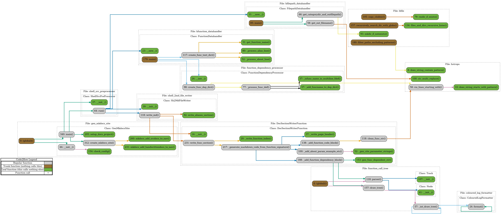

# BASH Auto Doc

[](https://app.deepsource.com/gh/stablecaps/bash-auto-doc/)
[](https://app.deepsource.com/gh/stablecaps/bash-auto-doc/)

[](https://github.com/stablecaps/bash-auto-doc/actions/workflows/test-python-app.yml)

[](https://github.com/stablecaps/bash-auto-doc/actions/workflows/github-repo-stats.yml)

### Broken badges
[](https://python-poetry.org/)
[][PyPI Releases]
[][PyPI Releases]
[][PyPI]
[](https://pypistats.org/packages/poetry)

# This is still a WIP!!!

## Overview
This project is a Python application that uses pip for package management. The main entry point for the application is gen_mkdocs_site.py.

## Getting Started

### Prerequisites
* Python 3.x
* pip

## Installation

```
git clone <repository_url>
cd <project_directory>
python -m venv venv
source venv/bin/activate
pip install -r requirements.txt
```

## Usage
```
# Run program to create mkdocs documentation site and serve it locally.
python gen_mkdocs_site.py --site-confname config/bash_it_site.yaml ---build-serve

# Show help
python gen_mkdocs_site.py --help
```

### Program options
1. `--site_confname` (str): The name of the site configuration.
2. `--build_serve` (bool): Whether to build and serve the local MkDocs site.
3. `--check_singlefile` (str): The path of a single shell source file to debug.
4. `--debug` (bool, optional): If True, debug information will be printed. Defaults to False.


## Program structure

**Auto-Documatix Callgraph:**
__(made with [Code2Flow](https://github.com/scottrogowski/code2flow))__



## Contributing
Please read CONTRIBUTING.md for details on our code of conduct, and the process for submitting pull requests to us.

## License
This project is licensed under the Apache 2.0 License - see the LICENSE.md file for details.

## Things to do still
1. **Setup and Configuration**
    1. use poetry to setup package & standalone app
    2. ~~set up python test coverage (link with deep source)~~
    ~~3. set up pre-commit hooks~~
    4. add create callgen to pre-commit hook
    5. ~~protect master branch~~
    6. package for pip

2. **Documentation**
    1. finish generating docstrings
    2. feed test data into docstrings (run tests on docstrings to check vailidity?)
    3. add contributing.md
    4. create GHA to auto generate BASH documentation for users

3. **Testing**
    1. finish tests using better data sources

4. **Project Management**
    1. write scripts to autogenerate template python repo (cookie-cutter)
    2. add badges
    3. create repo avatar image

5. **Bug Fixes and Improvements**
    1. fix paths so it works with windows - use Pathlib
    ~~2. move undefined md pages to undef category~~
    3. fix orphan single quote on value for about, param, etc
    4. Add features to jump to github code file from website
    5. List function calls across files?
    6. List function references across files?
    ~~7. Organise sidebar entries alphabetically~~


6. Mkdocs
    1. fix mkdocs search
    ~~2. fix input yaml so it works better with arbitrary mkdocs yaml~~
    ~~3. allow arbitrary mkdocs themes to be used~~

1. create python documentation website:
    1. investigate using mkdocstrings
    2. investigate using subsets of callgraph for viz
    3. create GHA to auto generate python documentation for nash-auto-doc repo

8. **Miscellaneous**
    1. amend readme to take into account poetry & also list instructions for standalone binary
    2. rename site to bashautodoc

## Not so Random info links

### Python call graphs
1. [Generating and using a Callgraph, in Python](https://cerfacs.fr/coop/pycallgraph)
2. [Quick & Simple Call Graphs in Python](https://medium.com/parkbee/quick-simple-call-graphs-in-python-eaa583d0e1b2)
    [pyan](https://github.com/Technologicat/pyan)
3. [Build a Call graph in python including modules and functions?](https://stackoverflow.com/questions/13963321/build-a-call-graph-in-python-including-modules-and-functions)
4. [What is a Call Graph? And How to Generate them Automatically](https://www.freecodecamp.org/news/how-to-automate-call-graph-creation/)
5. [Crabviz: a call graph generator for various programming languages](https://www.reddit.com/r/rust/comments/142is0h/crabviz_a_call_graph_generator_for_various/)
6. [**Insane**: Callgraphs with Ghidra, Pyhidra, and Jpype](https://clearbluejar.github.io/posts/callgraphs-with-ghidra-pyhidra-and-jpype/)
